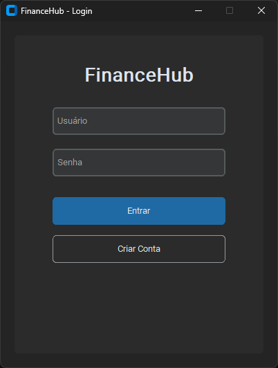
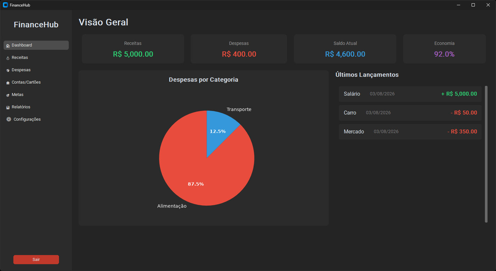
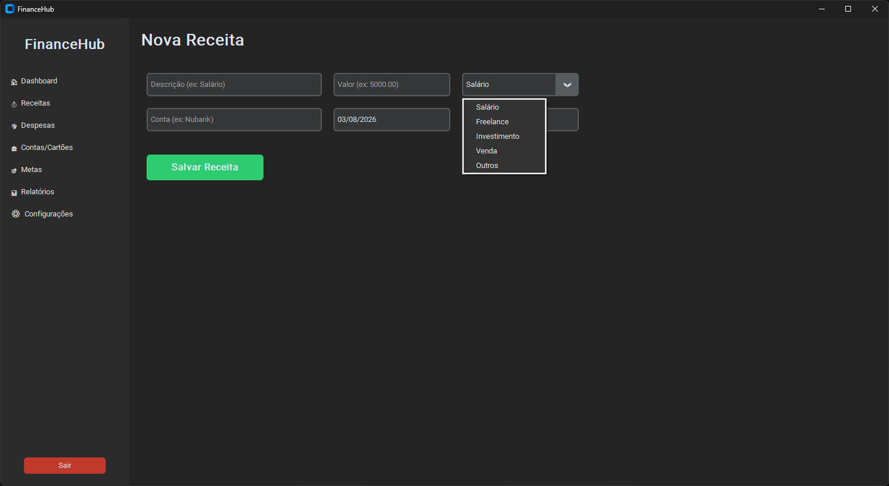
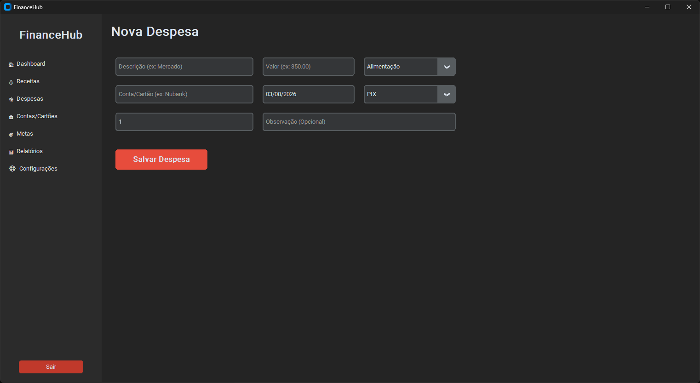
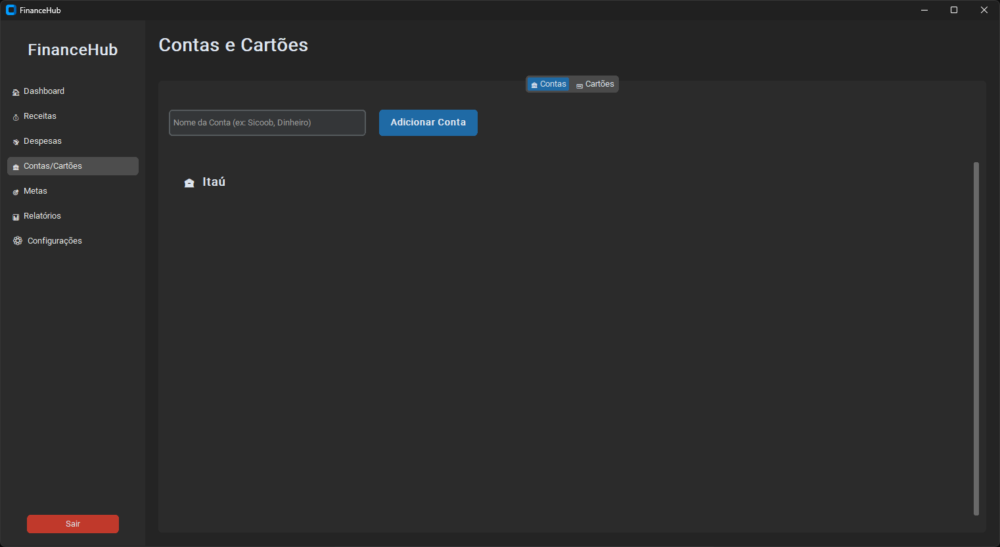
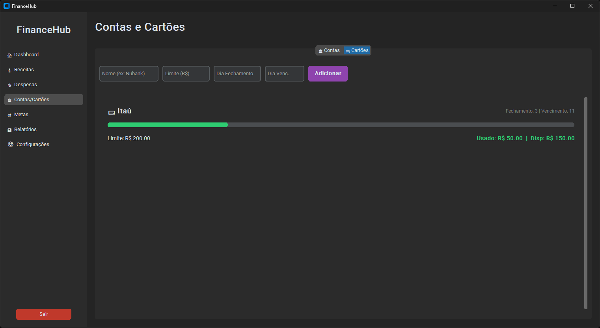
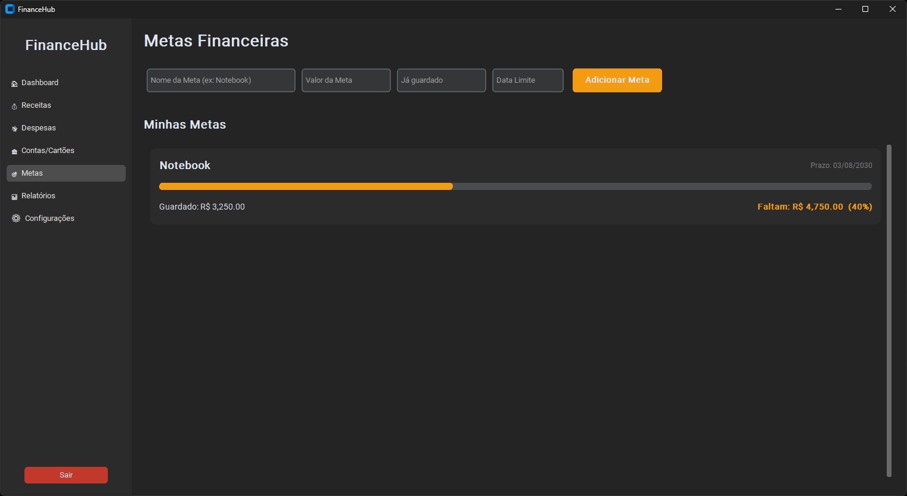
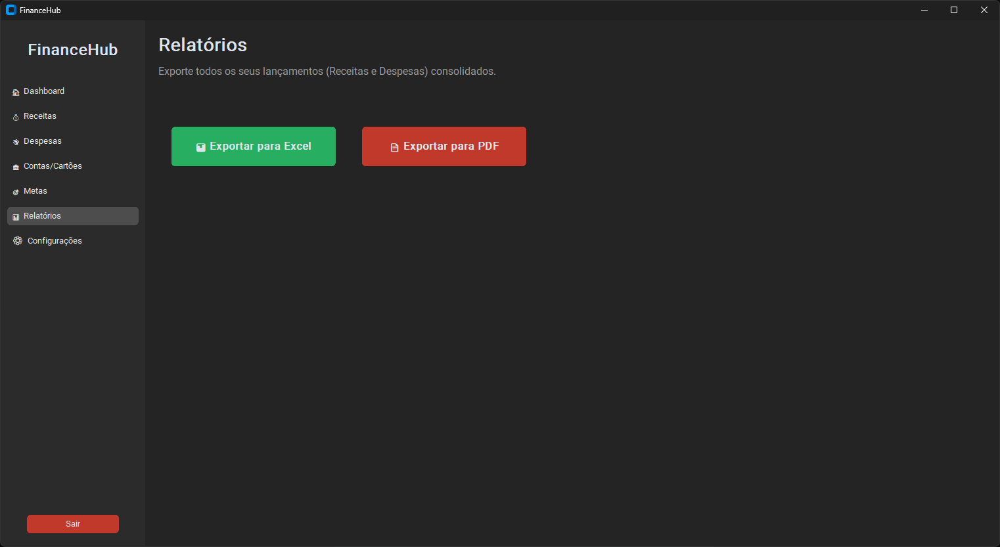
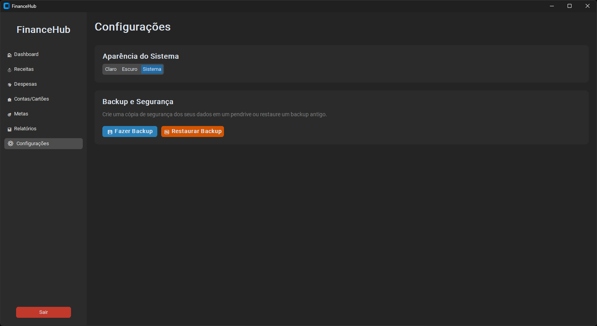

# 💰 FinanceHub

<p align="center">
  
</p>

<p align="center">
  Sistema desktop moderno para gerenciamento financeiro pessoal, desenvolvido em <strong>Python</strong>, utilizando a arquitetura <strong>MVC (Model-View-Controller)</strong>.
</p>

<p align="center">
  
  
  
</p>

---

# 📖 Sobre o Projeto

O **FinanceHub** é um sistema desktop para controle financeiro pessoal, criado com foco em simplicidade, organização e produtividade.

O software permite gerenciar receitas, despesas, cartões, contas bancárias, metas financeiras e gerar relatórios completos em PDF e Excel.

O projeto foi desenvolvido seguindo o padrão **MVC**, facilitando futuras expansões e manutenção do código.

---

# ✨ Funcionalidades

- 🔒 Login e cadastro de usuários
- 📊 Dashboard financeiro
- 💰 Cadastro de receitas
- 💸 Cadastro de despesas
- 🏦 Controle de contas bancárias
- 💳 Controle de cartões de crédito
- 🎯 Metas financeiras
- 📈 Gráficos e indicadores
- 📄 Exportação para PDF
- 📊 Exportação para Excel
- 🌙 Tema Claro/Escuro
- 💾 Backup e restauração do banco de dados
- 🔍 Pesquisa de lançamentos
- 📅 Filtros por período

---

# 🖥️ Interface

### 🔒 Login


### 📊 Dashboard


### 💰 Receitas


### 💸 Despesas


### 🏦 Contas


### 💳 Cartões


### 🎯 Metas Financeiras


### 📄 Relatórios


### ⚙️ Configurações


---

# 🛠️ Tecnologias Utilizadas

| Tecnologia | Descrição |
|------------|-----------|
| Python 3 | Linguagem principal |
| CustomTkinter | Interface gráfica moderna |
| SQLite3 | Banco de dados local |
| Pandas | Manipulação de dados |
| Matplotlib | Gráficos |
| ReportLab | Geração de PDF |
| OpenPyXL | Exportação Excel |
| Pillow | Manipulação de imagens |
| PyInstaller | Geração do executável |

---

# 📂 Estrutura do Projeto

```text
FinanceHub/
│
├── assets/
│   ├── icons/
│   ├── images/
│   └── logo.png
│
├── controllers/
│
├── database/
│   ├── database.py
│   └── finance.db
│
├── models/
│
├── reports/
│
├── utils/
│
├── views/
│
├── main.py
├── requirements.txt
└── README.md
```

---

# ⚙️ Instalação

## 1️⃣ Clone o repositório

```bash
git clone https://github.com/SEU_USUARIO/FinanceHub.git

cd FinanceHub
```

---

## 2️⃣ Crie um ambiente virtual (Opcional)

### Windows

```bash
python -m venv venv

venv\Scripts\activate
```

### Linux / macOS

```bash
python3 -m venv venv

source venv/bin/activate
```

---

## 3️⃣ Instale as dependências

```bash
pip install -r requirements.txt
```

---

## 4️⃣ Execute o projeto

```bash
python main.py
```

Na primeira execução será criado automaticamente o banco de dados:

```
finance.db
```

---

# 📦 Gerando o Executável (.exe)

Instale o PyInstaller:

```bash
pip install pyinstaller
```

Depois execute:

```bash
pyinstaller --noconfirm --noconsole --name FinanceHub --collect-all customtkinter main.py
```

O executável será criado em:

```
dist/
└── FinanceHub/
```

---

# 📊 Roadmap

- [x] Sistema de Login
- [x] Dashboard Financeiro
- [x] Cadastro de Receitas
- [x] Cadastro de Despesas
- [x] Contas Bancárias
- [x] Cartões
- [x] Metas Financeiras
- [x] Relatórios PDF
- [x] Relatórios Excel
- [x] Backup Automático
- [x] Tema Escuro
- [x] Tema Claro
- [x] Gráficos
- [ ] Pesquisa Inteligente
- [ ] Atualizador Automático

---

# 🤝 Contribuição

Contribuições são sempre bem-vindas.

Caso encontre algum problema ou tenha sugestões de melhorias:

1. Faça um Fork
2. Crie uma Branch

```bash
git checkout -b minha-feature
```

3. Commit

```bash
git commit -m "Minha nova feature"
```

4. Push

```bash
git push origin minha-feature
```

5. Abra um Pull Request.
